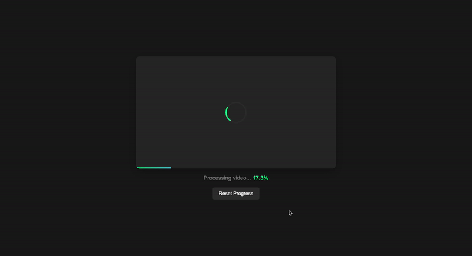
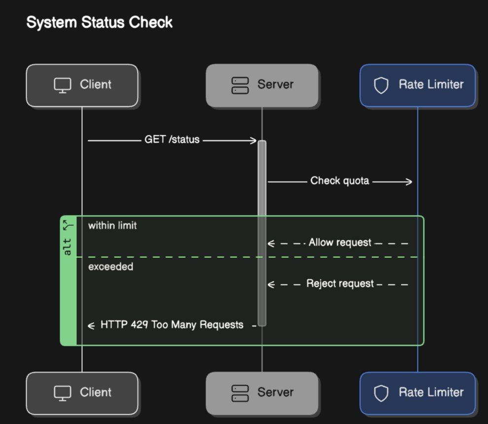

# Heygen Video Translation Simulation

This project provides a realistic video processing simulation with a modern UI. It includes both a backend server that simulates video processing progress and a frontend interface that displays the progress in real-time.

---

## Table of Contents

1. [Features](#features)
2. [Project Structure](#project-structure)
3. [Installation](#installation)
4. [Usage](#usage)
5. [Configuration](#configuration)
6. [Scripts](#scripts)


---

## Features

### Server
- Simulates realistic video processing progress
- Gradual progress increments (0.5-2% per second)
- Progress naturally slows down near completion
- Random completion chance when progress > 95%
- Reset endpoint to restart the simulation
- Graceful shutdown handling

### Frontend UI
- Modern, dark-themed interface
- Responsive video placeholder
- Smooth progress bar with gradient effect
- Animated loading spinner
- Completion checkmark animation
- Reset button to restart the process
- Real-time progress updates
- Error handling with automatic retries

### Integration
- Server and UI communicate via REST API
- Automatic reconnection on connection loss
- Smooth progress transitions
- Progress persistence across page reloads



---

## Project Structure

```plaintext
heygen-assignment/
├── src/
│   ├── middleware/         # Middleware for logging and error handling
│   ├── server.js          # Main server file with progress simulation
├── index.html             # Frontend UI
├── package.json           # Dependencies and scripts
├── README.md             # Project documentation
└── .gitignore           # Ignored files and folders
```

## Installation

1. Clone the Repository:
```bash
git clone https://github.com/XayHanmonty/heygenassignment.git
cd heygenassignment
```

2. Install dependencies:
```bash
npm install
```

## Usage

1. Start the Server:
```bash
node src/server.js
```

2. Open the UI:
- Open `http://localhost:3000` in your web browser
- The progress simulation will start automatically
- Use the Reset button to restart the simulation at any time

## API Endpoints

### GET /status
Returns the current processing status and progress.

Response:
```json
{
    "status": "processing|complete",
    "progress": 45.5
}
```

### POST /reset
Resets the progress simulation to 0%.

Response:
```json
{
    "status": "reset",
    "progress": 0
}
```

## Configuration

The server runs on port 3000 by default. You can modify this by setting the `PORT` environment variable.

## Scripts

- `npm start`: Start the server
- `npm run dev`: Start the server with nodemon for development
